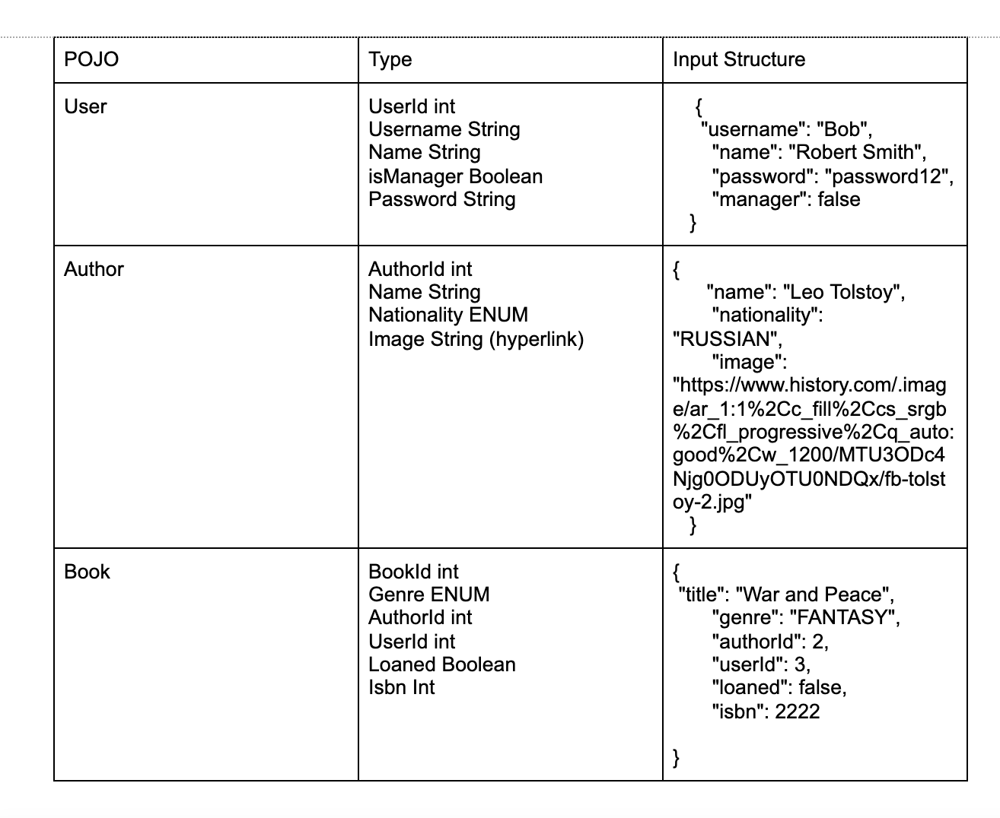
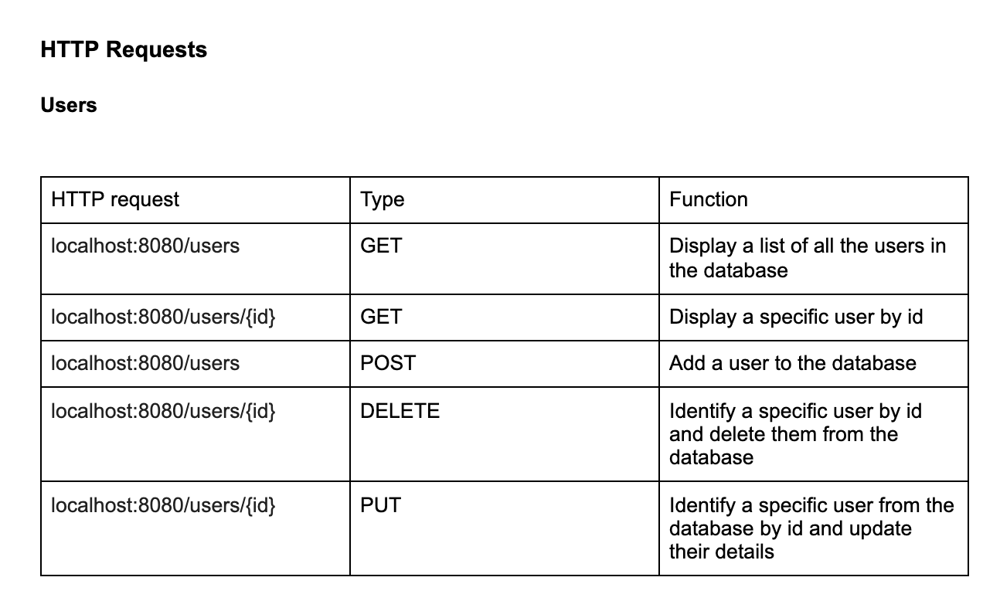
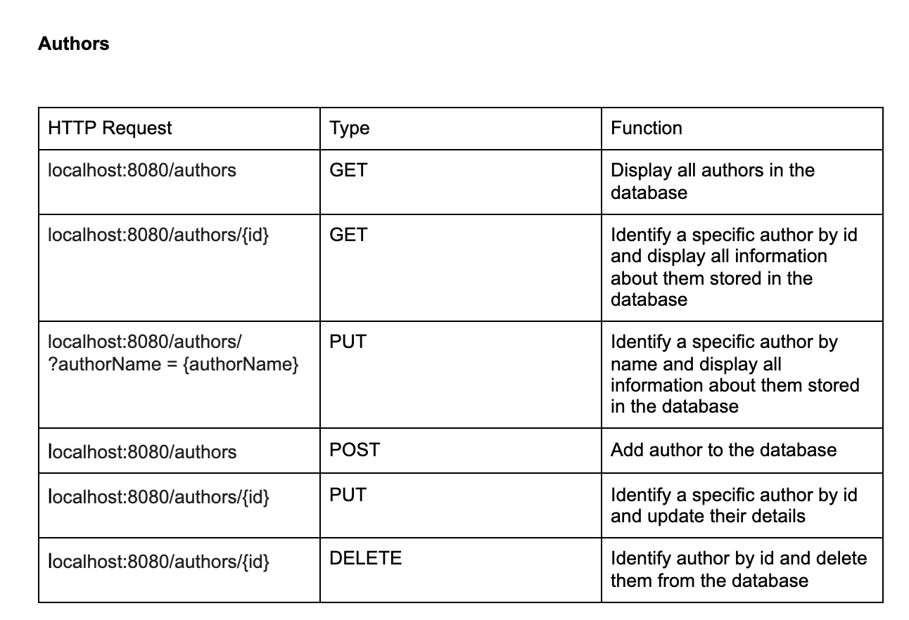
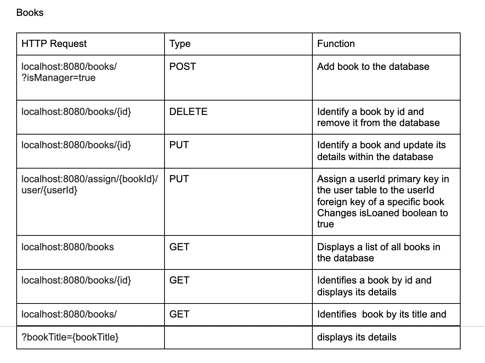

ReadMe
# library system Back-End Group Project

We are The 1-UP Team, a team consisting of [BNTA](https://techacademy.brightnetwork.co.uk/) Cohort 4 members, [Connie](https://github.com/conniebernardin), [Michelle](https://github.com/MichelleRafols), [Wendy](https://github.com/WendyDiane), [zhengyang](https://github.com/Zhengyang).


<!-- Include Tech Stack - how client-side was built -->

## Introduction

This collaborative project consists of a Library Booking System using java17 as our main language, PostgreSQL to create and store our database, SQL for our queries, SpringBoot to connect the server to the database, and Postman for our API testing.

The project was completed as part of the BNTA programme. <br><br>

The team started by creating a flowchart as a visual representation of how the user interacts with the backend of the application. The first method created was to enable new users to create a user profile and for current users/managers to login to the system. Then the users can search up, loan books and/or use another service. The library system also enables the manager, and only the manager to access and update the books in our database. 

<!--  -->

<!-- What we've created, what inspired it -->


The team also created an entity relationship diagram that shows the relationship among the tables in our Postgres database, which includes books, authors and users. Each table is linked through a many to one relationship using a foreign key. This displays how to set up the databases for efficient communication and relations. 

<!--  -->

<!-- What we've created, what inspired it -->


## Step-by-step instructions for set up

# How to: Set up your PostgreSQL database

1. Make sure that you have installed [Java](https://jdk.java.net/17/) and [PostgresQL](https://www.postgresql.org/)
   <br><br>
2. Clone this repository:
   ``git@github.com:zhengyangqiu/BookingSystem.git`` and open in your Java IDE of choice (in our case, we used IntelliJ)
   (https://www.jetbrains.com/idea/download/#section=mac))
   <br><br>
3.Now you can open the repository in your Java IDE (in our case, we used IntelliJ)

4.Open PostgreSQL and create a new PostgreSQL database called library system by copying the following command into the SQL Query section: 
``CREATE DATABASE librarysytem`` ; <br>(If using the terminal, type ``psql`` to launch PostgresQL, and then run ``CREATE DATABASE librarysystem;``)
   <br><br>

5.Once again in PostgreSQL, create your tables for authors, users and books by copying the following code: 


```sql
-- CREATE TABLE authors (
   author_id SERIAL PRIMARY KEY,
   name VARCHAR(255) NOT NULL,
   nationality VARCHAR(255),
   image TEXT);
```

```sql
-- CREATE TABLE users (
   user_id SERIAL PRIMARY KEY,
   name VARCHAR(255) NOT NULL,
   username VARCHAR (255) NOT NULL,
   isManager BOOLEAN NOT NULL,
   password VARCHAR(255) NOT NULL
);

```

```sql
-- CREATE TABLE books (
   bookid SERIAL PRIMARY KEY,
   title VARCHAR(255) NOT NULL,
   genre VARCHAR(255) NOT NULL,
   author_id INT REFERENCES authors(author_id),
   user_id INT REFERENCES users(user_id),
   loaned BOOLEAN NOT NULL,
   ISBN INT NOT NULL
);

```


6.Now, you can populate your tables with authors, users and books of your choice. Let’s help you get started on this by copying the following code: 


```sql
-- INSERT INTO books (title, genre, author_id, loaned, ISBN) VALUES ('Emma', 'Classic', 1, FALSE, 1234);

```
```sql
-- INSERT INTO authors (name, nationality) VALUES ('Jane Austen', 'English');

```


```sql
-- INSERT INTO books (title, genre, author_id, loaned, ISBN) VALUES ('Pride and Prejudice', 'Classic', 1, FALSE, 12345);
```

```sql
-- INSERT INTO users (name, username, isManager, password) VALUES ('Yang', 'Yang', TRUE, 'password');
```

```sql
-- INSERT INTO users (name, username, isManager, password) VALUES ('Wendy', 'WendyDiane', FALSE, 'password');
```

```sql
-- INSERT INTO users (name, username, isManager, password) VALUES ('Michelle', 'Michelle', FALSE, 'password');
```

```sql
-- INSERT INTO users (name, username, isManager, password) VALUES ('Connie', 'ConnieB', FALSE, 'password');

```


**And a final Note** — you can also find the SQL queries in steps 5 & 6 in our libraryDataBase.sql file on our IntelliJ repo. You can accordingly follow the DROP TABLE queries in the file if in any case you need to delete your database. Otherwise, you can ignore them. 

8. And done! Your database is now ready to use.


## 

 

Plain Old Java Objects (POJOS):


List of the basic java objects and the properties they contain


<!--  -->

<!-- What we've created, what inspired it -->


<!--  -->

<!-- What we've created, what inspired it -->


<!--  -->

<!-- What we've created, what inspired it -->


<!--  -->

<!-- What we've created, what inspired it -->


### Minimum Viable Product (MVP)


**Must-haves:**
_Helper Mode_
*Service logic
*Integration of an API (Controller), to send HTTP requests to progress library system between Postgres
*Integration with database containing the books,users and authors (DAO interface with database implementation)
*SQL file, with instructions to set up database and tables in the postico.

_Competitive Mode
*Allow user to create User,books and authors POJOs
*Create a user, book, author in database
*Allow user to  get, input,delete and update the information of books, authors
*Allow users to create account and set password for them
*Allow user to assign book to user

### Potential Extensions to MVP
**Nice-to-haves (if time):
*Leaderboard
*Authentication
***Stretch objective:
*Test Edge Cases

##Acknowledgements
A huge thanks to the [BNTA](https://techacademy.brightnetwork.co.uk/) team, and especially to our trainers, [Colin](), [Nelson](), and [Iain]()!


